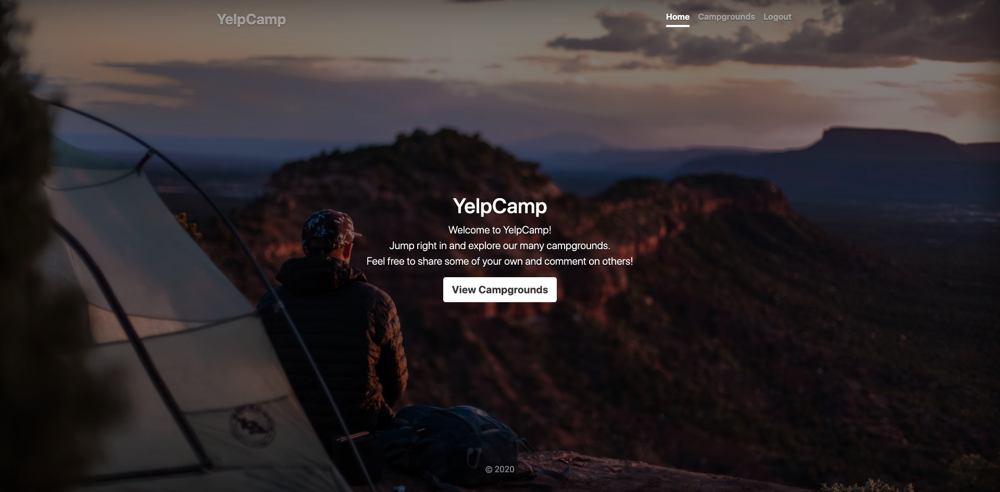
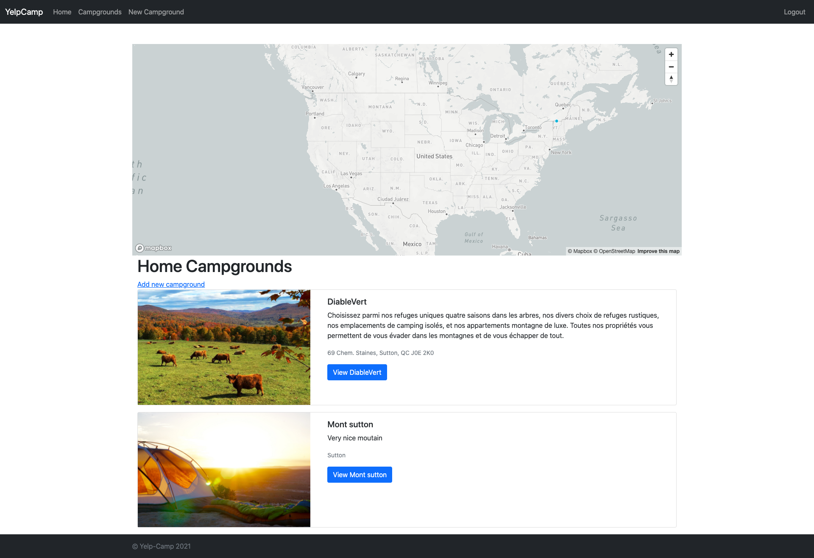

<h1 align="center">YELP CAMP PROJECT</h1>

  <h3>
    <a href="https://damp-ridge-48657.herokuapp.com/">
      Demo
    </a>
     | 
    <a href="https://github.com/Jacquescode/YelpCamp-Project/">
      Solution
    </a>
  </h3>

## Overview

## Technoligie Use
- Nodejs
- Express.js
- Ejs
- MongoDB

## Principal NPM and API
- express
- ejs
- mongoose
- map-Box
- cloudinary
- flash
- joi
- helmet
- passport
- multer

## Contact

- Website [Jonaspace.com](https://jonaspace.com/)
- GitHub [JacquesCode](https://github.com/Jacquescode)
- Twitter [JojacquesQc](https://twitter.com/JoJacquesQc)
